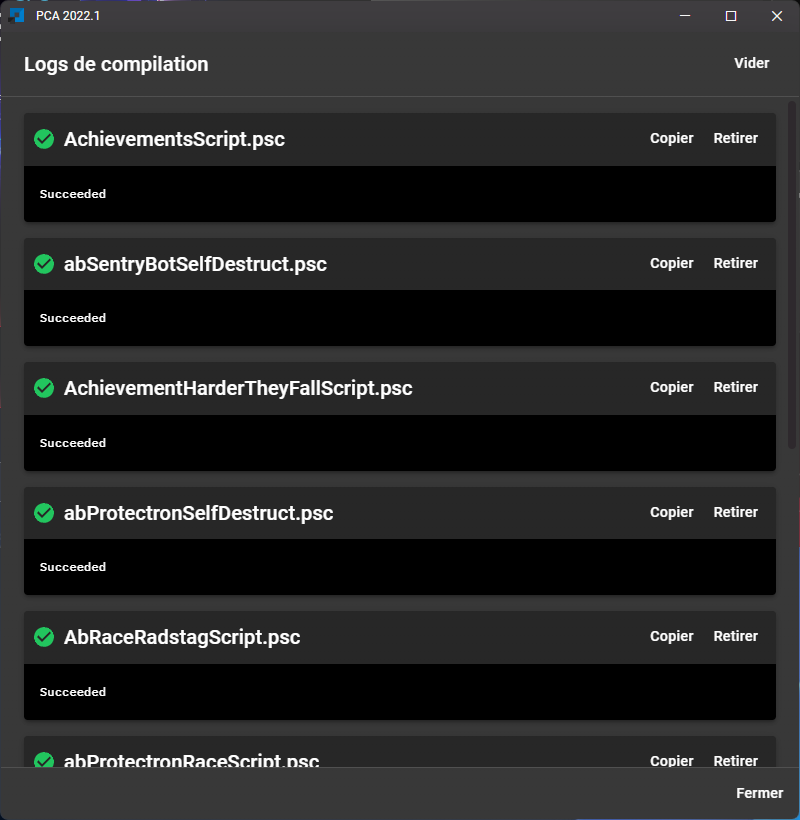
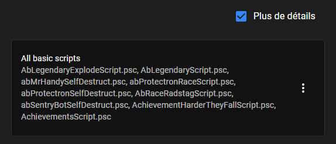
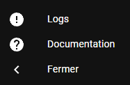
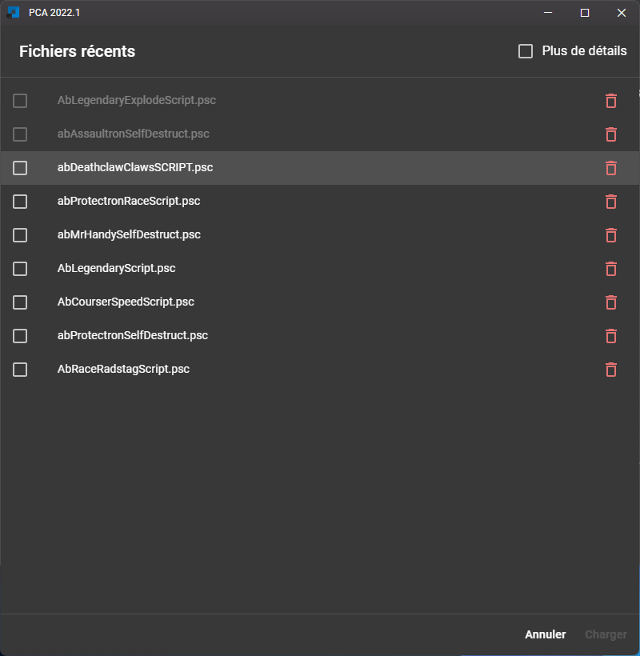
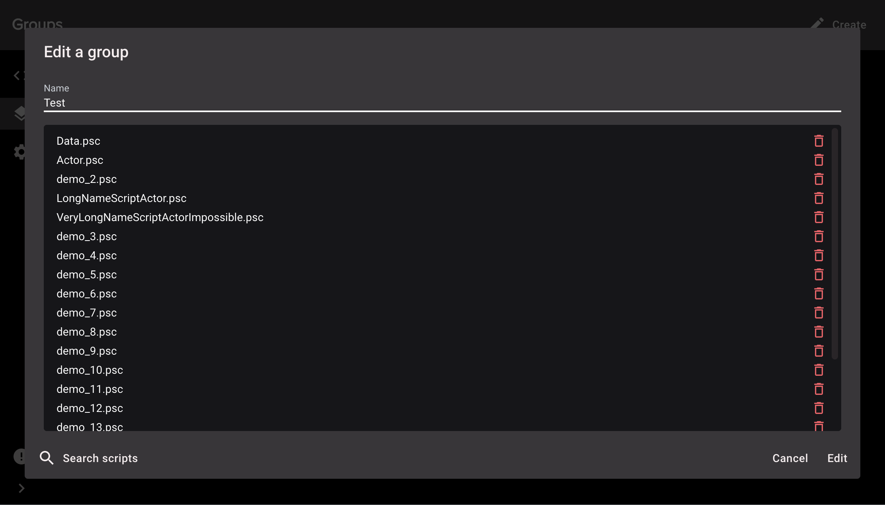
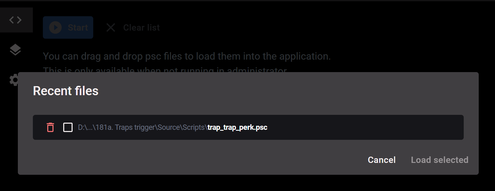

## 5.8.0 (2022-05-06)

### Bug fixes

- **Fallout 4 support**
- "Command line is too long" error should occur less by using Powershell. Powershell is installed by default starting with Windows 7.
- When closing the drawer panel, links could break into multiple lines
- Duplicated logs entry
- Changelog window correctly displays images

### Features

- New compilation logs view

  

- Group preview is replaced with a new "more details" button

  
  

- New design
- The configuration is now checked when you enter the compilation page, giving you any tips if your configuration is wrong.
- Better mo2 configuration check
- Button to open compilation logs now changes color at the end of a compilation

  _Green_: when all scripts compile successfully

  _Red_: when a script gone wrong

- New documentation released: access the documentation via NexusMods or with the new button at the bottom left

  

- You can now compile a single script in the list

  

- Recent files: option to show the script's full path (#130)
- Recent files dialog displays more scripts at once

  It is now easier to click on a line

  

- A loading screen now appear when the application start

  

- New application titlebar

  The application menu is now accessible with the application icon at the left

  

- The position of the app is now memoized between launch
- Bumps dependencies
- The application restarts when resetting the configuration

## 5.7.0 (2021-08-17)

### Features

- Dialogs can be validated with "Enter" (#119)
- Display a preview of a group when you hover the mouse over it (#118)

  

### Improvements

- Telemetry event "AppLoaded" now send the application version (#114)
- Telemetry are sent in a job queue (#123)
- Group dialog is bigger and display more scripts at once (#117)

  

## 5.6.0 (2021-06-10)

### Features

- Recent compiled files appears in a new section called **"Recent files"**

  You can now add files faster

- App top bar is now draggable
- The "waiting to compile" icon has been deleted

  This icon could show that a compilation was in progress when not

- Application menu bar items are now
  translated (PCA only supports `english` and `french` at the moment, helps are welcome)

- When checking for updates, a message now appear when you're already using the latest version

  

### Bug fixes

- Texts could appear behind scrollable section
- New release dialog could have malformed texts

## 5.5.2 (2021-04-25)

### Bug fixes

- Fix the new version popup background in light theme

- FO4 support - Creation Kit installation

  PCA was checking your Creation Kit installation by searching for `YOUR_GAME/Data/Scripts/Source/Actor.psc` file.

  This was invalid because Fallout 4 use `YOUR_GAME/Data/Scripts/Source/Base/Actor.psc`

## 5.5.1 (2021-03-18)

### Bug fixes

- Fixes a bug with telemetry

## 5.5.0 (2021-03-17)

### Features

- Add anonymous telemetry data (can be disabled)
- Choose which theme to use, from your system, light, or dark

## 5.4.0 (2021-03-13)

### Features

- Added support for Fallout 4, closes ([#84](https://github.com/Kiyozz/papyrus-compiler-app/issues/84))
- Update of the application design
- Adding a light theme, closes ([#85](https://github.com/Kiyozz/papyrus-compiler-app/issues/85))
- The theme of the application adapts to your system preferences

### Bug fixes

- Sometimes PCA could not recover errors from a compilation

## 5.3.0 (2021-02-04) ([v5.2.0...v5.3.0](https://github.com/Kiyozz/papyrus-compiler-app/compare/v5.2.0...v5.3.0))

### Features

- titlebar ([09b1f5d](https://github.com/Kiyozz/papyrus-compiler-app/commit/09b1f5dd8e85272e49ca29c438209d738ea87e8b))

## 5.2.0 (2021-01-27) [v5.1.0...v5.2.0](https://github.com/Kiyozz/papyrus-compiler-app/compare/v5.1.0...v5.2.0)

### Features

- multi thread compilation ([b4b2102](https://github.com/Kiyozz/papyrus-compiler-app/commit/b4b21027052416ca1dd06a373a2efa50ddece8ee))
- tutorial ([07556a2](https://github.com/Kiyozz/papyrus-compiler-app/commit/07556a259bae04f22edc9541774c2c9267a6d898))
- copy compilation logs ([2a581bf](https://github.com/Kiyozz/papyrus-compiler-app/commit/2a581bff60e3201e77ab9f90111d8bf5f111dc8e))
- change version indication design and drop files overlay design ([d2c6d67](https://github.com/Kiyozz/papyrus-compiler-app/commit/d2c6d67ecbd79f98fa66198fe1f0ecbaac61834c))
- check for updates in menu ([6cd97ac](https://github.com/Kiyozz/papyrus-compiler-app/commit/6cd97ac34d2c8828c61319d09ca97f333217821b)), closes [#77](https://github.com/Kiyozz/papyrus-compiler-app/issues/77)

### Bug Fixes

- config migrations ([40ed565](https://github.com/Kiyozz/papyrus-compiler-app/commit/40ed5650bf5c630e2e9f080dc4141fdada533413))

## 5.1.0 (2021-01-07) [v5.0.0...v5.1.0](https://github.com/Kiyozz/papyrus-compiler-app/compare/v5.0.0...v5.1.0)

### Features

- add skyrim vr support ([c64d642](https://github.com/Kiyozz/papyrus-compiler-app/commit/c64d64284429243893f22a269deaee842410cb64))
- smaller text in compilation logs ([32a000a](https://github.com/Kiyozz/papyrus-compiler-app/commit/32a000ae792c05b94d07bb3e3d30b5525340b0bd))

### Bug Fixes

- menu transparent, loading indicator ([9af41b0](https://github.com/Kiyozz/papyrus-compiler-app/commit/9af41b076dddd2007e73f165983de78e981371e4))

## 5.0.0 (2020-12-30) [v4.5.0...v5.0.0](https://github.com/Kiyozz/papyrus-compiler-app/compare/v4.5.0...v5.0.0)

### Features

- design overall, general optimization ([#69](https://github.com/Kiyozz/papyrus-compiler-app/pull/69))
- use the app in debug mode ([110102c](https://github.com/Kiyozz/papyrus-compiler-app/commit/110102cdcf7a77d3cda1304c1a91a4e70e86ff71))
- better configuration error explanation ([26c1e21](https://github.com/Kiyozz/papyrus-compiler-app/commit/26c1e215857c6b1aa071981643ce6e32da4c3952))
- better mo2 compilation ([66e6ac1](https://github.com/Kiyozz/papyrus-compiler-app/commit/66e6ac10b89240d83ccb84592a30a666fe2fd841))
- add the left panel expand ([839aff2](https://github.com/Kiyozz/papyrus-compiler-app/commit/839aff26c8d99bc103dca5d71b921000aae9d92b))

## 4.5.0 (2020-11-19) [v4.4.0...v4.5.0](https://github.com/Kiyozz/papyrus-compiler-app/compare/v4.4.0...v4.5.0)

### Features

- refresh the configuration on "refresh" click ([#64](https://github.com/Kiyozz/papyrus-compiler-app/issues/64)) ([bc85baf](https://github.com/Kiyozz/papyrus-compiler-app/commit/bc85baf3a9bb614b14b1cc01f50015ae0e711814)), closes [#60](https://github.com/Kiyozz/papyrus-compiler-app/issues/60) [#61](https://github.com/Kiyozz/papyrus-compiler-app/issues/61)

### Bug Fixes

- change some env to new format ([#63](https://github.com/Kiyozz/papyrus-compiler-app/issues/63)) ([57dfca1](https://github.com/Kiyozz/papyrus-compiler-app/commit/57dfca126c03ec97b79779e5f9265d543c601858)), closes [#62](https://github.com/Kiyozz/papyrus-compiler-app/issues/62)

## 4.4.0 (2020-11-12) [v4.3.0...v4.4.0](https://github.com/Kiyozz/papyrus-compiler-app/compare/v4.3.0...v4.4.0)

### Features

- add compiler path configuration; reducing the font size of folder inputs ([#56](https://github.com/Kiyozz/papyrus-compiler-app/issues/56)) ([13116a9](https://github.com/Kiyozz/papyrus-compiler-app/commit/13116a94642f3e1329cf91753f7199959c378db9)), closes [#55](https://github.com/Kiyozz/papyrus-compiler-app/issues/55)
- better log message ([#59](https://github.com/Kiyozz/papyrus-compiler-app/issues/59)) ([be6a905](https://github.com/Kiyozz/papyrus-compiler-app/commit/be6a9059cd90e48eb9316950e4e4501c3a8dda4d)), closes [#57](https://github.com/Kiyozz/papyrus-compiler-app/issues/57) [#58](https://github.com/Kiyozz/papyrus-compiler-app/issues/58)
- more debug message with --debug ([#59](https://github.com/Kiyozz/papyrus-compiler-app/issues/59)) ([be6a905](https://github.com/Kiyozz/papyrus-compiler-app/commit/be6a9059cd90e48eb9316950e4e4501c3a8dda4d)), closes [#57](https://github.com/Kiyozz/papyrus-compiler-app/issues/57) [#58](https://github.com/Kiyozz/papyrus-compiler-app/issues/58)

## 4.3.0 (2020-11-07) [v4.2.0...v4.3.0](https://github.com/Kiyozz/papyrus-compiler-app/compare/v4.2.0...v4.3.0)

### Features

- create/update group dialog now focus on name input ([#48](https://github.com/Kiyozz/papyrus-compiler-app/issues/48)) ([7677270](https://github.com/Kiyozz/papyrus-compiler-app/commit/76772704fee34f91658f5928646f6ff3427c626a)), closes [#43](https://github.com/Kiyozz/papyrus-compiler-app/issues/43)
- papyrus compiler path no longer relative to game path ([#45](https://github.com/Kiyozz/papyrus-compiler-app/issues/45)) ([8bbae32](https://github.com/Kiyozz/papyrus-compiler-app/commit/8bbae32a9be02e3396a3d48323e7ad4f2f50081e)), closes [#40](https://github.com/Kiyozz/papyrus-compiler-app/issues/40)
- better bad installation error message ([#45](https://github.com/Kiyozz/papyrus-compiler-app/issues/45)) ([8bbae32](https://github.com/Kiyozz/papyrus-compiler-app/commit/8bbae32a9be02e3396a3d48323e7ad4f2f50081e)), closes [#42](https://github.com/Kiyozz/papyrus-compiler-app/issues/42)
- scripts list no longer displays "last modified at" ([#41](https://github.com/Kiyozz/papyrus-compiler-app/issues/41)) ([537b9ae](https://github.com/Kiyozz/papyrus-compiler-app/commit/537b9ae80bce8618366873bfe2b6b7f3c11024b6)), closes [#39](https://github.com/Kiyozz/papyrus-compiler-app/issues/39)

### Bug Fixes

- configuration reset ([#47](https://github.com/Kiyozz/papyrus-compiler-app/issues/47)) ([e60dd3b](https://github.com/Kiyozz/papyrus-compiler-app/commit/e60dd3b689811f48e08f5a0d56d0b3b92dc46dac)), closes [#44](https://github.com/Kiyozz/papyrus-compiler-app/issues/44)
- performance on typing game path or mo2 instance ([#54](https://github.com/Kiyozz/papyrus-compiler-app/issues/54)) ([9dcc4b2](https://github.com/Kiyozz/papyrus-compiler-app/commit/9dcc4b2e90748cc7081f2518000c92f672ac6674)), closes [#50](https://github.com/Kiyozz/papyrus-compiler-app/issues/50)

## 4.2.0 (2020-10-27) [v4.1.1...v4.2.0](https://github.com/Kiyozz/papyrus-compiler-app/compare/v4.1.1...v4.2.0)

### Features

- input folder now accept manually added text ([#35](https://github.com/Kiyozz/papyrus-compiler-app/pull/35)) ([b43ec2f](https://github.com/Kiyozz/papyrus-compiler-app/commit/b43ec2ff781ed9e651ef5fdee60c299ba3300108)), closes [#28](https://github.com/Kiyozz/papyrus-compiler-app/issues/28)
- changelog alert silent ([#37](https://github.com/Kiyozz/papyrus-compiler-app/pull/37)) ([9d74ca5](https://github.com/Kiyozz/papyrus-compiler-app/commit/9d74ca58f7560b3503159d0c92e01bbe4986bd83)), closes [#32](https://github.com/Kiyozz/papyrus-compiler-app/issues/32)
- swap colors of buttons in compilation page ([#38](https://github.com/Kiyozz/papyrus-compiler-app/pull/38)) ([164c460](https://github.com/Kiyozz/papyrus-compiler-app/commit/164c4609924f5951c6c6c0e94b67b3e65259c7a8)), closes [#30](https://github.com/Kiyozz/papyrus-compiler-app/issues/30)
- update dependencies ([#36](https://github.com/Kiyozz/papyrus-compiler-app/pull/36)) ([ab36e16](https://github.com/Kiyozz/papyrus-compiler-app/commit/ab36e1676b8e81aa338b096a39e146f3b0568d33)), closes [#33](https://github.com/Kiyozz/papyrus-compiler-app/issues/33)

### Bug Fixes

- allow logs to be selectable ([#34](https://github.com/Kiyozz/papyrus-compiler-app/pull/34)) ([e056c99](https://github.com/Kiyozz/papyrus-compiler-app/commit/e056c9952c89820db7b961f4a68af1d3da5eec3c)), closes [#29](https://github.com/Kiyozz/papyrus-compiler-app/issues/29)

## 4.1.1 (2020-08-24) [v4.1.0...v4.1.1](https://github.com/Kiyozz/papyrus-compiler-app/compare/v4.1.0...v4.1.1)

### Bug Fixes

- using the app through MO2 VFS re-works

## 4.1.0 (2020-08-23)

### Features

- changelog dialog improved
- global refactoring
- preferences are now handled in a json file
- preferences can be reset via the app menu
- preferences can be opened via the app menu
- theme of the app updated
- report a bug via the new button "Help > Report bug"
- open the log file of the previous session with "Help > Previous session logs"
- the button to open log file has been removed from UI in favor of app menu button
- list of scripts from MO2 in settings removed
- path of the MO2 "mods" folder can be set in preferences in the json file relative to the mo2 instance
- output default can be set in the json file relative to the gamePath
- output mo2 can be set in the json file relative to the mo2 instance
