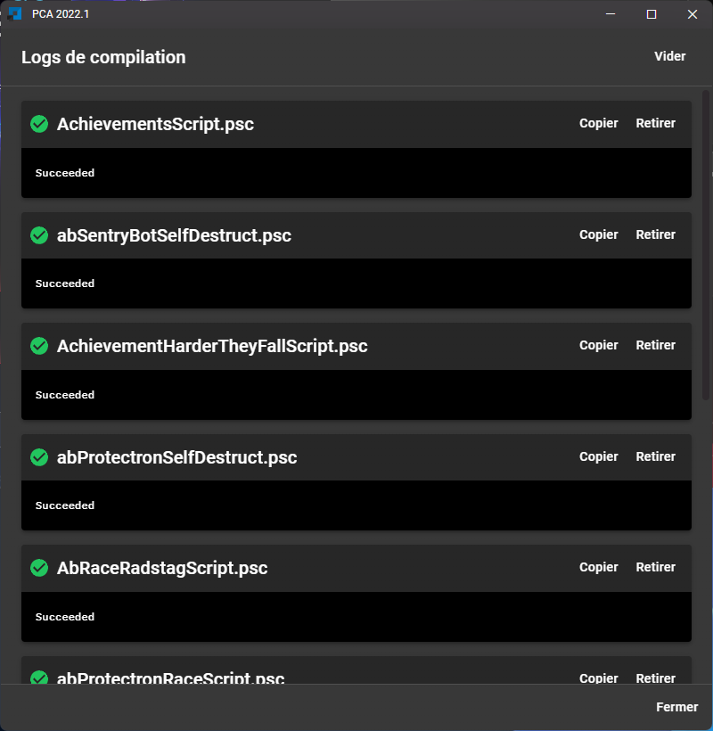
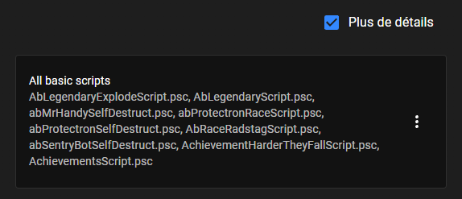
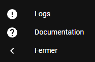
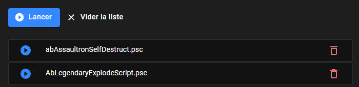
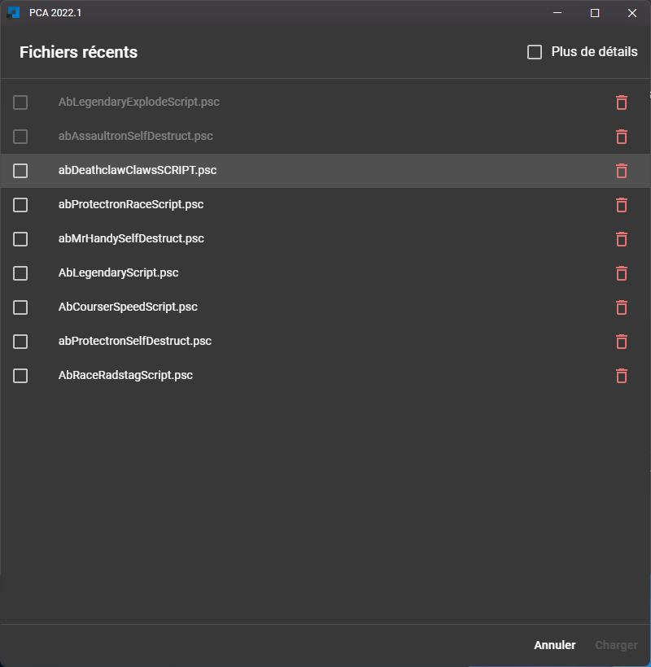
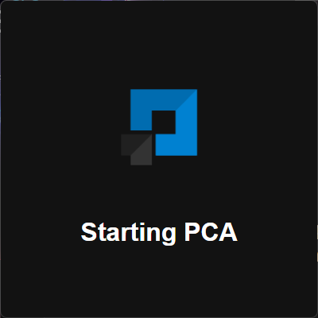
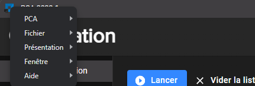
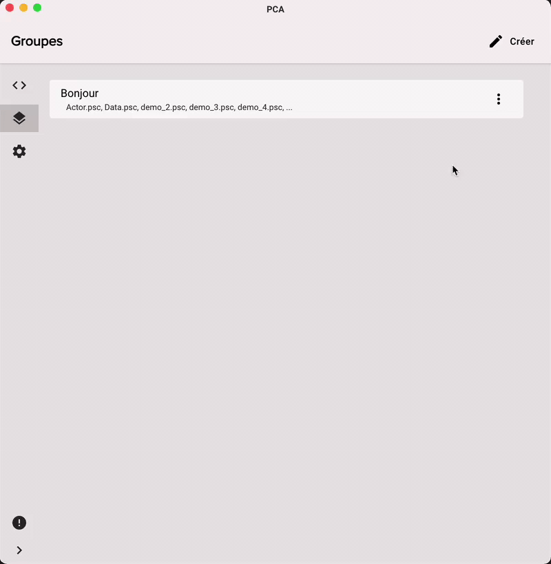
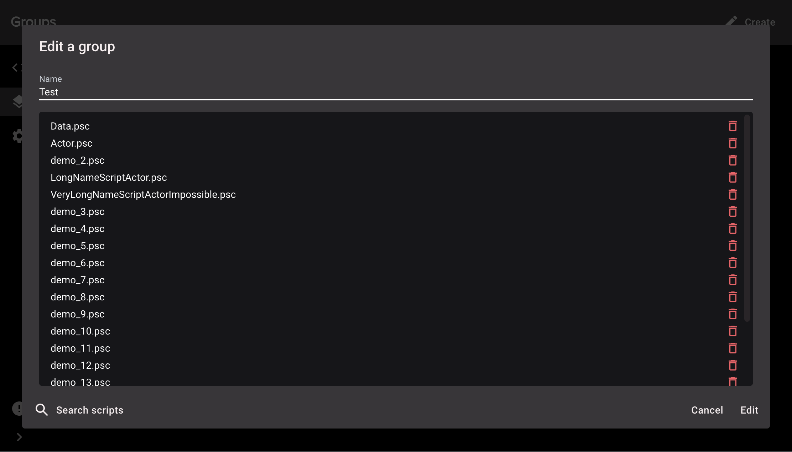
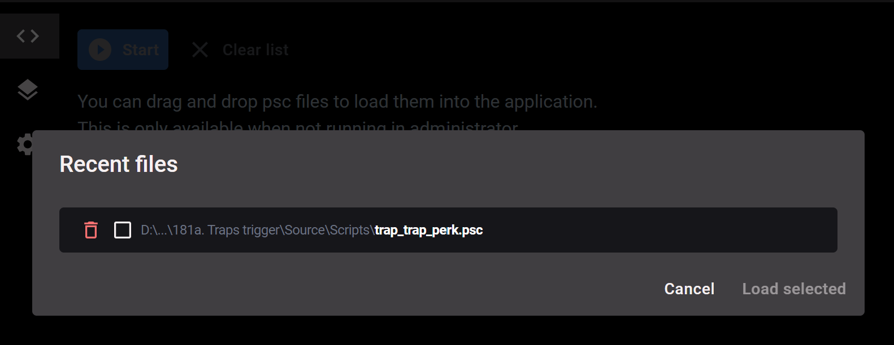

## 5.9.0

### Minor Changes

- 786c340: Migrate from react-router to @tanstack/react-router with file-based routing via Vite plugin.
- 70c9f3c: Add language switcher in settings (EN/FR), persist locale, sync native menu on change.
- a967b8a: Replace custom electron-ipc package with kkrpc for typed bidirectional RPC.
- e13a847: Add log level setting (error/warn/info/debug) in settings, remove --debug CLI flag.
- 87cf4c1: Compile scripts from any folder (script's parent dir auto-imported).
  Customize compilation output folder.
  Deprecate MO2 integration: shows warning when enabled, no longer scans mods.
- 9a5fbd7: Fix telemetry configuration: the API URL was read from the feature flag variable, and the renderer never received its build-time values at all (Vite only exposes `VITE_`-prefixed variables). Environment variables are now prefixed `PCA_` instead of `ELECTRON_`.
- 4a5f7f7: Settings: show the app version, and fix the last section being cut off when the window is too short.
- 5aa2c4f: Upgrade Electron 41 -> 44, electron-builder 26.15, tsdown 0.22,
  electron-tsdown 12 and kkrpc 0.6 -> 2.

  kkrpc v2 replaces the `kkrpc/electron-ipc` IO adapters with transports from
  `kkrpc/electron`, and the main/renderer channels now take their local API
  through the channel options instead of `RPCChannel.expose()`. Its default IPC
  channel is also renamed, so the preload bridge allows the `kkrpc:` prefix.

  Electron 44 removed the two-argument `clipboard.writeText(text, 'selection')`
  form; the Linux selection clipboard now lives under `clipboard.selection`.

- 405ddd4: Support Papyrus namespaces (Fallout 4, Starfield). The namespace declared in the psc header (`Scriptname MyMod01:Script`) is now given to the compiler, the namespace root folder is imported instead of the script folder, and the pex is written to its namespace subfolder.

  Fallout 4 imports are reduced to the three roots the game actually uses — `Scripts/Source`, `Scripts/Source/Base` and `Scripts/Source/User` — instead of globbing every subfolder four levels deep. Those subfolders are namespace folders, not roots: the compiler walks down to them on its own. On a stock Fallout 4 install this takes the command line from 64 imports to 4, which makes the `ENAMETOOLONG` limit much harder to hit.

- 405ddd4: Fix Starfield support, which could not compile anything: the game executable was looked up as `Startfield.exe`, its sources were expected in `Data/Source/Scripts` instead of `Data/Scripts/Source`, the config check looked for `Base/Actor.psc` when Starfield has no `Base` folder, and `Starfield_Papyrus_Flags.flg` was not a selectable flag. Selecting Starfield in the settings also silently reverted to Skyrim: the store's game type check listed the four other games and reset anything else, so the choice was overwritten on the next config check while the game path and flag stayed on Starfield. It now reuses the shared `validateGame.gameType()` instead of its own outdated list.

  Starfield keeps every script under `Scripts/Source` — its subfolders are namespaces — so that folder is now its only import root.

- 6ec7ab4: Button to open the folder the pex was written to, in the script list and in the compilation logs. Namespaces (Fallout 4, Starfield) included.
- 94c4b57: Setup wizard on first launch (game, folder, Creation Kit) and a detailed Creation Kit report in the settings.

  PCA now tells apart a missing Creation Kit, source archives nobody extracted, a compiler that cannot be found and missing sources, each with the matching action: install from Steam, extract the .zip archives from PCA (Fallout 4 Base and DLC, Skyrim SE Scripts.zip, Starfield ContentResources.zip), open the folder or pick PapyrusCompiler.exe.

  An archive is read to know whether it was already extracted and where it unfolds, so the Fallout 4 archives are found wherever the kit dropped them.

  Errors when the configured compiler belongs to another, incompatible game, and a non blocking warning when SKSE or F4SE is installed without its .psc source scripts.

  Fix: the default compiler path for Starfield points at `Tools\Papyrus Compiler`, and it is found again when the game or its folder changes.

  Fix: a dialog no longer grows past the window, its body scrolls instead.

- 72fd243: Skyrim SE and VR: a warning when source scripts are left in `Data\Scripts\Source`, the Skyrim LE folder. Their Creation Kit only reads `Data\Source\Scripts`, and PCA imports the LE folder first, so an outdated copy of the game scripts left in there shadows the one the game ships and the compilation fails for no apparent reason. The report recommends moving everything to `Data\Source\Scripts` and opens the folder.

  The Compilation page now also raises the non blocking warnings, this one and the script extender without its sources, and no longer the errors only. An error still comes first when there is one.

- 22f7a7d: Anonymization of the compiled scripts, on by default and switchable off in the compilation settings. The compiler writes the path of the source script, the user name and the computer name in the pex header, all three readable by anyone who opens the file: PCA now replaces them with random strings of the very same lengths once the compilation succeeded. Nothing else is touched, the compilation time and every byte of the compiled code included, and the pex keeps its size. Skyrim, Fallout 4 and Starfield alike, and whichever compiler PCA is pointed at.

  An existing configuration is upgraded with the anonymization on, as a new one is. When it fails, the compilation stays a success, the script is compiled after all, and the reason is raised in its log.

- 4863736: Migrate every UI component from Radix UI to Base UI. `radix-ui` is gone from the dependency tree, `components.json` now targets the `base-maia` style, and all 19 wrappers (button, dialog, sheet, select, tooltip, the menu family, sidebar, form...) use `@base-ui/react`. Composition moves from `asChild` to `render`, and popups gain Base UI's `Portal > Positioner > Popup` anatomy. No visible change is expected beyond two details: double-clicking a form label now selects its text (Radix used to block it), and sheet transitions are CSS-driven instead of keyframed.

### Patch Changes

- dbc9a4c: Remove tutorial components, types, store checks, migrations code, and translations.
- 11e5054: Fix: statut des scripts en page Compilation après migration kkrpc.
- d8d94c5: CI: automated changesets release (bot version PR, `v*` tag, GitHub release from the CHANGELOG with the packaged archive attached).
- 3140e72: Replace the dead `RELEASE_VERSION` plumbing with a calendar-style public version (`2026.1`) bumped automatically on release.
- 0c1d7c8: Upgrade Lingui to v6 (ESM-only, base64url message ids, formatter config).
- 7cb25f3: Upgrade oxlint to 1.80 and oxfmt to 0.65.
- 83d288f: Upgrade @changesets/cli to 3.0.1, TypeScript to 7.0.2, plus vite 8.2.2, zod 4.5.2, uuid 14.0.2. Add a `typecheck` script and run it in CI.
- 83d288f: Point the documentation URL to https://pca.kiyozz.com.
- 5aa2c4f: Pin Lingui's `descriptorFields` in the main process build.

  It defaults to `auto`, which resolves through `process.env.NODE_ENV` while
  transforming — inside rolldown's workers, where the value electron-tsdown sets
  is not reliably visible. Two consecutive production builds could disagree on
  whether the `message` fallback field was stripped. The value is now resolved
  once, when the config is evaluated.

- f068506: Fix the add scripts button staying disabled after closing the file picker without selecting anything. The picker fires `cancel` in that case, never `change`, so the flag tracking the open dialog was never cleared.
- 6a3d624: Log an error when an unsupported game type reaches `toExecutable` instead of falling back to the Skyrim SE executable in silence, which used to make a corrupted game type look like the user had picked Skyrim.
- 6a3d624: Give the renderer a way to write to the electron-log files. It had no logger at all: its few `console` calls only ever reached the devtools and were lost once the app was packaged. Renderer entries now go through the bridge and are written by the main process under a `Renderer:<scope>` scope, so they show up in the log files users send along with a bug report.
- 83d288f: Send the `App.FirstLoaded` telemetry event again on the very first launch, with the app version and the public version.
- 376cf81: Fix telemetry never being sent: `electron-fetch` only ships CommonJS, so its default import resolved to the module object instead of the fetch function in the ESM main process. Replaced by Electron `net.fetch` and the dependency is dropped.
- 2a3608f: Compile the script that was picked, not a namesake found in the game sources. The compiler resolves a script name against the current working directory (always first) then the imports in order, keeping the first match: the folder of the script is now both the working directory and the first import. Fixes wrong script compiled when several import folders hold the same name, typically under MO2 where Data merges every mod.
- 052f11d: Show the real result of a run on its compilation log entry. The Success/Failure badge was derived from the script status captured before compilation started, so it showed the previous run's outcome (and "Failure" on a first run). Each log entry now carries the compiler result it came from.
- 6c2237b: Migrate the changelog dialog off MUI to Base UI and sonner, render the release notes with @tailwindcss/typography, and drop the @mui and @emotion dependencies.
- 4e26bd6: Fix: Selects des settings contrôlés et affichage du libellé sélectionné (au lieu de la valeur brute) après migration Base UI.

  Le dialogue Documentation affiche désormais un descriptif, l'URL et un bouton d'ouverture, au lieu d'un placeholder.

- 18ab1d5: CI: upload every release to the NexusMods pages (Skyrim LE, Skyrim SE, Fallout 4, Starfield) with `Nexus-Mods/upload-action`, changelog included, then publish the GitHub release that stays a draft until the archive is there. The `mod_id`/`file_id` pair of a page comes from repository variables, an unset pair skips it, and `scripts/nexus-ids.mjs` resolves them.
- 0e50bbe: Fix: the recent files list no longer overflows the dialog when the window is too small to display it entirely.
- 8626efa: Fix: the settings fields now follow the configuration when it is changed from outside the form, such as the Creation Kit diagnostic picking the compiler for you.

## 5.8.0 (2022-05-06)

### Bug fixes

- **Fallout 4 support**
- "Command line is too long" error should occur less by using Powershell. Powershell is installed by default starting with Windows 7.
- When closing the drawer panel, links could break into multiple lines
- Duplicated logs entry
- Changelog window correctly displays images

### Features

- New compilation logs view

  

- Group preview is replaced with a new "more details" button

  
  

- New design
- The configuration is now checked when you enter the compilation page, giving you any tips if your configuration is wrong.
- Better mo2 configuration check
- Button to open compilation logs now changes color at the end of a compilation

  _Green_: when all scripts compile successfully

  _Red_: when a script gone wrong

- New documentation released: access the documentation via NexusMods or with the new button at the bottom left

  

- You can now compile a single script in the list

  

- Recent files: option to show the script's full path (#130)
- Recent files dialog displays more scripts at once

  It is now easier to click on a line

  

- A loading screen now appear when the application start

  

- New application titlebar

  The application menu is now accessible with the application icon at the left

  

- The position of the app is now memoized between launch
- Bumps dependencies
- The application restarts when resetting the configuration

## 5.7.0 (2021-08-17)

### Features

- Dialogs can be validated with "Enter" (#119)
- Display a preview of a group when you hover the mouse over it (#118)

  

### Improvements

- Telemetry event "AppLoaded" now send the application version (#114)
- Telemetry are sent in a job queue (#123)
- Group dialog is bigger and display more scripts at once (#117)

  

## 5.6.0 (2021-06-10)

### Features

- Recent compiled files appears in a new section called **"Recent files"**

  You can now add files faster

- App top bar is now draggable
- The "waiting to compile" icon has been deleted

  This icon could show that a compilation was in progress when not

- Application menu bar items are now
  translated (PCA only supports `english` and `french` at the moment, helps are welcome)

- When checking for updates, a message now appear when you're already using the latest version

  

### Bug fixes

- Texts could appear behind scrollable section
- New release dialog could have malformed texts

## 5.5.2 (2021-04-25)

### Bug fixes

- Fix the new version popup background in light theme

- FO4 support - Creation Kit installation

  PCA was checking your Creation Kit installation by searching for `YOUR_GAME/Data/Scripts/Source/Actor.psc` file.

  This was invalid because Fallout 4 use `YOUR_GAME/Data/Scripts/Source/Base/Actor.psc`

## 5.5.1 (2021-03-18)

### Bug fixes

- Fixes a bug with telemetry

## 5.5.0 (2021-03-17)

### Features

- Add anonymous telemetry data (can be disabled)
- Choose which theme to use, from your system, light, or dark

## 5.4.0 (2021-03-13)

### Features

- Added support for Fallout 4, closes ([#84](https://github.com/Kiyozz/papyrus-compiler-app/issues/84))
- Update of the application design
- Adding a light theme, closes ([#85](https://github.com/Kiyozz/papyrus-compiler-app/issues/85))
- The theme of the application adapts to your system preferences

### Bug fixes

- Sometimes PCA could not recover errors from a compilation

## 5.3.0 (2021-02-04) ([v5.2.0...v5.3.0](https://github.com/Kiyozz/papyrus-compiler-app/compare/v5.2.0...v5.3.0))

### Features

- titlebar ([09b1f5d](https://github.com/Kiyozz/papyrus-compiler-app/commit/09b1f5dd8e85272e49ca29c438209d738ea87e8b))

## 5.2.0 (2021-01-27) [v5.1.0...v5.2.0](https://github.com/Kiyozz/papyrus-compiler-app/compare/v5.1.0...v5.2.0)

### Features

- multi thread compilation ([b4b2102](https://github.com/Kiyozz/papyrus-compiler-app/commit/b4b21027052416ca1dd06a373a2efa50ddece8ee))
- tutorial ([07556a2](https://github.com/Kiyozz/papyrus-compiler-app/commit/07556a259bae04f22edc9541774c2c9267a6d898))
- copy compilation logs ([2a581bf](https://github.com/Kiyozz/papyrus-compiler-app/commit/2a581bff60e3201e77ab9f90111d8bf5f111dc8e))
- change version indication design and drop files overlay design ([d2c6d67](https://github.com/Kiyozz/papyrus-compiler-app/commit/d2c6d67ecbd79f98fa66198fe1f0ecbaac61834c))
- check for updates in menu ([6cd97ac](https://github.com/Kiyozz/papyrus-compiler-app/commit/6cd97ac34d2c8828c61319d09ca97f333217821b)), closes [#77](https://github.com/Kiyozz/papyrus-compiler-app/issues/77)

### Bug Fixes

- config migrations ([40ed565](https://github.com/Kiyozz/papyrus-compiler-app/commit/40ed5650bf5c630e2e9f080dc4141fdada533413))

## 5.1.0 (2021-01-07) [v5.0.0...v5.1.0](https://github.com/Kiyozz/papyrus-compiler-app/compare/v5.0.0...v5.1.0)

### Features

- add skyrim vr support ([c64d642](https://github.com/Kiyozz/papyrus-compiler-app/commit/c64d64284429243893f22a269deaee842410cb64))
- smaller text in compilation logs ([32a000a](https://github.com/Kiyozz/papyrus-compiler-app/commit/32a000ae792c05b94d07bb3e3d30b5525340b0bd))

### Bug Fixes

- menu transparent, loading indicator ([9af41b0](https://github.com/Kiyozz/papyrus-compiler-app/commit/9af41b076dddd2007e73f165983de78e981371e4))

## 5.0.0 (2020-12-30) [v4.5.0...v5.0.0](https://github.com/Kiyozz/papyrus-compiler-app/compare/v4.5.0...v5.0.0)

### Features

- design overall, general optimization ([#69](https://github.com/Kiyozz/papyrus-compiler-app/pull/69))
- use the app in debug mode ([110102c](https://github.com/Kiyozz/papyrus-compiler-app/commit/110102cdcf7a77d3cda1304c1a91a4e70e86ff71))
- better configuration error explanation ([26c1e21](https://github.com/Kiyozz/papyrus-compiler-app/commit/26c1e215857c6b1aa071981643ce6e32da4c3952))
- better mo2 compilation ([66e6ac1](https://github.com/Kiyozz/papyrus-compiler-app/commit/66e6ac10b89240d83ccb84592a30a666fe2fd841))
- add the left panel expand ([839aff2](https://github.com/Kiyozz/papyrus-compiler-app/commit/839aff26c8d99bc103dca5d71b921000aae9d92b))

## 4.5.0 (2020-11-19) [v4.4.0...v4.5.0](https://github.com/Kiyozz/papyrus-compiler-app/compare/v4.4.0...v4.5.0)

### Features

- refresh the configuration on "refresh" click ([#64](https://github.com/Kiyozz/papyrus-compiler-app/issues/64)) ([bc85baf](https://github.com/Kiyozz/papyrus-compiler-app/commit/bc85baf3a9bb614b14b1cc01f50015ae0e711814)), closes [#60](https://github.com/Kiyozz/papyrus-compiler-app/issues/60) [#61](https://github.com/Kiyozz/papyrus-compiler-app/issues/61)

### Bug Fixes

- change some env to new format ([#63](https://github.com/Kiyozz/papyrus-compiler-app/issues/63)) ([57dfca1](https://github.com/Kiyozz/papyrus-compiler-app/commit/57dfca126c03ec97b79779e5f9265d543c601858)), closes [#62](https://github.com/Kiyozz/papyrus-compiler-app/issues/62)

## 4.4.0 (2020-11-12) [v4.3.0...v4.4.0](https://github.com/Kiyozz/papyrus-compiler-app/compare/v4.3.0...v4.4.0)

### Features

- add compiler path configuration; reducing the font size of folder inputs ([#56](https://github.com/Kiyozz/papyrus-compiler-app/issues/56)) ([13116a9](https://github.com/Kiyozz/papyrus-compiler-app/commit/13116a94642f3e1329cf91753f7199959c378db9)), closes [#55](https://github.com/Kiyozz/papyrus-compiler-app/issues/55)
- better log message ([#59](https://github.com/Kiyozz/papyrus-compiler-app/issues/59)) ([be6a905](https://github.com/Kiyozz/papyrus-compiler-app/commit/be6a9059cd90e48eb9316950e4e4501c3a8dda4d)), closes [#57](https://github.com/Kiyozz/papyrus-compiler-app/issues/57) [#58](https://github.com/Kiyozz/papyrus-compiler-app/issues/58)
- more debug message with --debug ([#59](https://github.com/Kiyozz/papyrus-compiler-app/issues/59)) ([be6a905](https://github.com/Kiyozz/papyrus-compiler-app/commit/be6a9059cd90e48eb9316950e4e4501c3a8dda4d)), closes [#57](https://github.com/Kiyozz/papyrus-compiler-app/issues/57) [#58](https://github.com/Kiyozz/papyrus-compiler-app/issues/58)

## 4.3.0 (2020-11-07) [v4.2.0...v4.3.0](https://github.com/Kiyozz/papyrus-compiler-app/compare/v4.2.0...v4.3.0)

### Features

- create/update group dialog now focus on name input ([#48](https://github.com/Kiyozz/papyrus-compiler-app/issues/48)) ([7677270](https://github.com/Kiyozz/papyrus-compiler-app/commit/76772704fee34f91658f5928646f6ff3427c626a)), closes [#43](https://github.com/Kiyozz/papyrus-compiler-app/issues/43)
- papyrus compiler path no longer relative to game path ([#45](https://github.com/Kiyozz/papyrus-compiler-app/issues/45)) ([8bbae32](https://github.com/Kiyozz/papyrus-compiler-app/commit/8bbae32a9be02e3396a3d48323e7ad4f2f50081e)), closes [#40](https://github.com/Kiyozz/papyrus-compiler-app/issues/40)
- better bad installation error message ([#45](https://github.com/Kiyozz/papyrus-compiler-app/issues/45)) ([8bbae32](https://github.com/Kiyozz/papyrus-compiler-app/commit/8bbae32a9be02e3396a3d48323e7ad4f2f50081e)), closes [#42](https://github.com/Kiyozz/papyrus-compiler-app/issues/42)
- scripts list no longer displays "last modified at" ([#41](https://github.com/Kiyozz/papyrus-compiler-app/issues/41)) ([537b9ae](https://github.com/Kiyozz/papyrus-compiler-app/commit/537b9ae80bce8618366873bfe2b6b7f3c11024b6)), closes [#39](https://github.com/Kiyozz/papyrus-compiler-app/issues/39)

### Bug Fixes

- configuration reset ([#47](https://github.com/Kiyozz/papyrus-compiler-app/issues/47)) ([e60dd3b](https://github.com/Kiyozz/papyrus-compiler-app/commit/e60dd3b689811f48e08f5a0d56d0b3b92dc46dac)), closes [#44](https://github.com/Kiyozz/papyrus-compiler-app/issues/44)
- performance on typing game path or mo2 instance ([#54](https://github.com/Kiyozz/papyrus-compiler-app/issues/54)) ([9dcc4b2](https://github.com/Kiyozz/papyrus-compiler-app/commit/9dcc4b2e90748cc7081f2518000c92f672ac6674)), closes [#50](https://github.com/Kiyozz/papyrus-compiler-app/issues/50)

## 4.2.0 (2020-10-27) [v4.1.1...v4.2.0](https://github.com/Kiyozz/papyrus-compiler-app/compare/v4.1.1...v4.2.0)

### Features

- input folder now accept manually added text ([#35](https://github.com/Kiyozz/papyrus-compiler-app/pull/35)) ([b43ec2f](https://github.com/Kiyozz/papyrus-compiler-app/commit/b43ec2ff781ed9e651ef5fdee60c299ba3300108)), closes [#28](https://github.com/Kiyozz/papyrus-compiler-app/issues/28)
- changelog alert silent ([#37](https://github.com/Kiyozz/papyrus-compiler-app/pull/37)) ([9d74ca5](https://github.com/Kiyozz/papyrus-compiler-app/commit/9d74ca58f7560b3503159d0c92e01bbe4986bd83)), closes [#32](https://github.com/Kiyozz/papyrus-compiler-app/issues/32)
- swap colors of buttons in compilation page ([#38](https://github.com/Kiyozz/papyrus-compiler-app/pull/38)) ([164c460](https://github.com/Kiyozz/papyrus-compiler-app/commit/164c4609924f5951c6c6c0e94b67b3e65259c7a8)), closes [#30](https://github.com/Kiyozz/papyrus-compiler-app/issues/30)
- update dependencies ([#36](https://github.com/Kiyozz/papyrus-compiler-app/pull/36)) ([ab36e16](https://github.com/Kiyozz/papyrus-compiler-app/commit/ab36e1676b8e81aa338b096a39e146f3b0568d33)), closes [#33](https://github.com/Kiyozz/papyrus-compiler-app/issues/33)

### Bug Fixes

- allow logs to be selectable ([#34](https://github.com/Kiyozz/papyrus-compiler-app/pull/34)) ([e056c99](https://github.com/Kiyozz/papyrus-compiler-app/commit/e056c9952c89820db7b961f4a68af1d3da5eec3c)), closes [#29](https://github.com/Kiyozz/papyrus-compiler-app/issues/29)

## 4.1.1 (2020-08-24) [v4.1.0...v4.1.1](https://github.com/Kiyozz/papyrus-compiler-app/compare/v4.1.0...v4.1.1)

### Bug Fixes

- using the app through MO2 VFS re-works

## 4.1.0 (2020-08-23)

### Features

- changelog dialog improved
- global refactoring
- preferences are now handled in a json file
- preferences can be reset via the app menu
- preferences can be opened via the app menu
- theme of the app updated
- report a bug via the new button "Help > Report bug"
- open the log file of the previous session with "Help > Previous session logs"
- the button to open log file has been removed from UI in favor of app menu button
- list of scripts from MO2 in settings removed
- path of the MO2 "mods" folder can be set in preferences in the json file relative to the mo2 instance
- output default can be set in the json file relative to the gamePath
- output mo2 can be set in the json file relative to the mo2 instance
