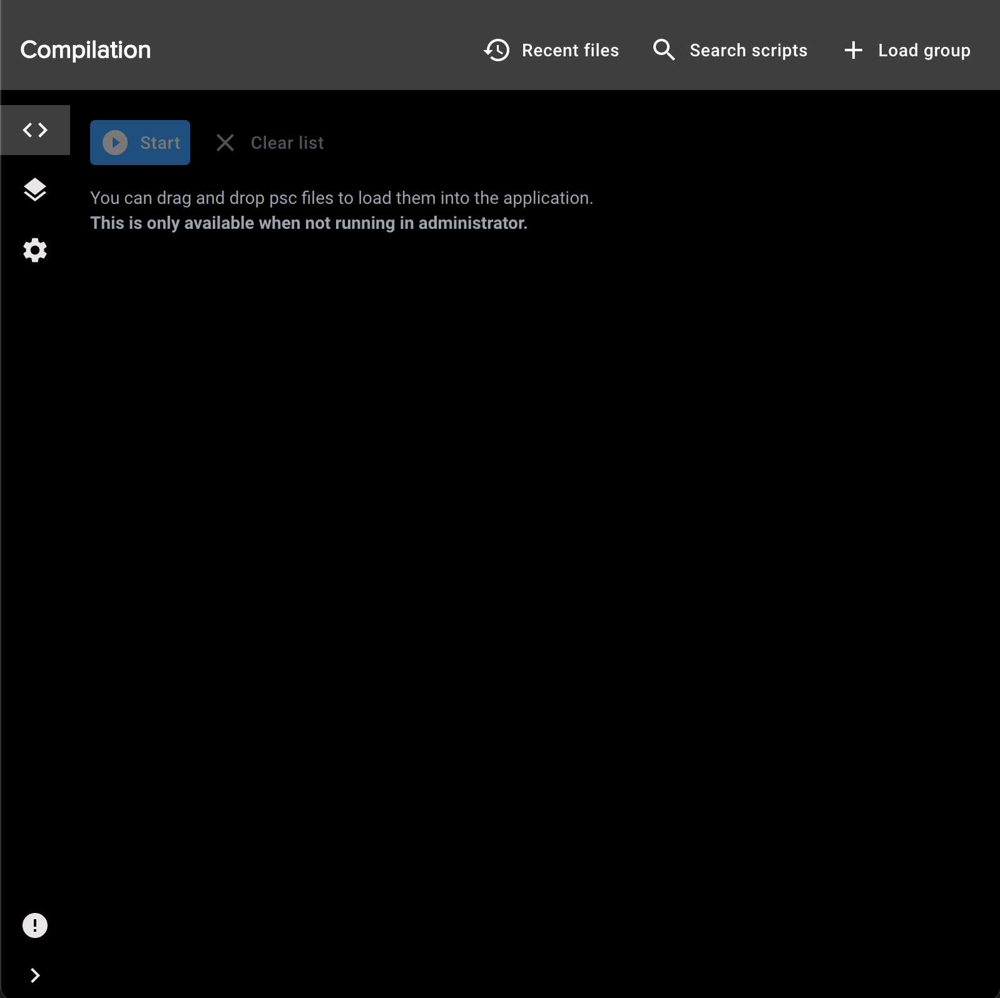
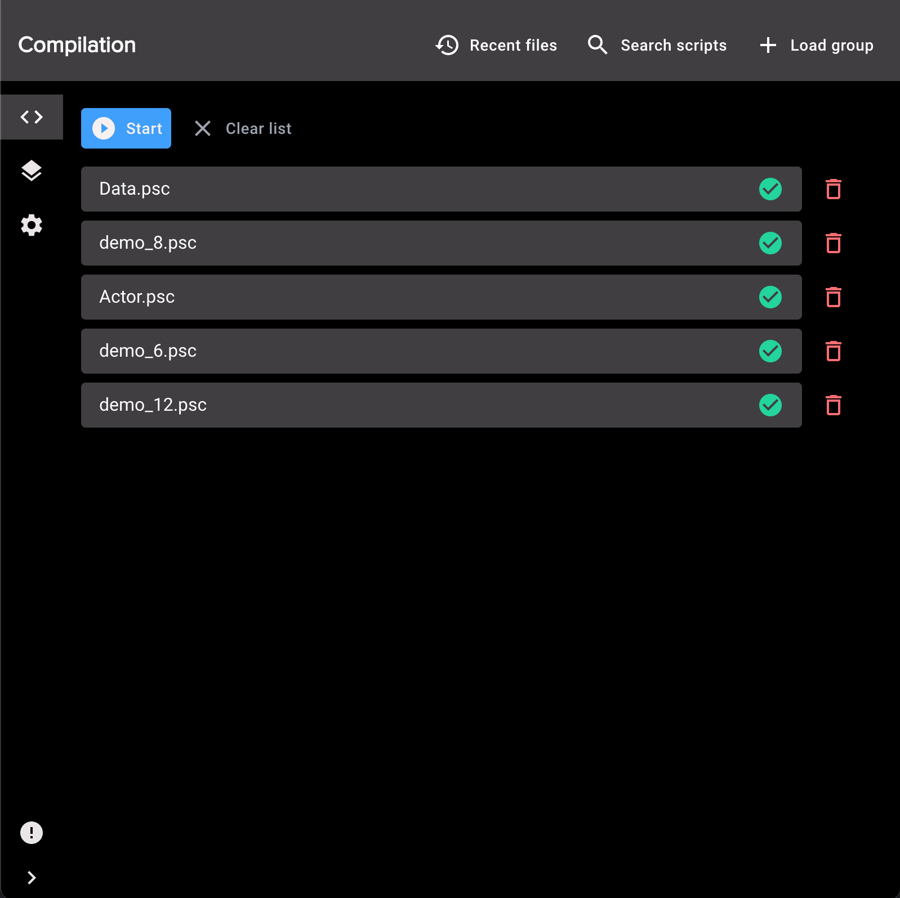
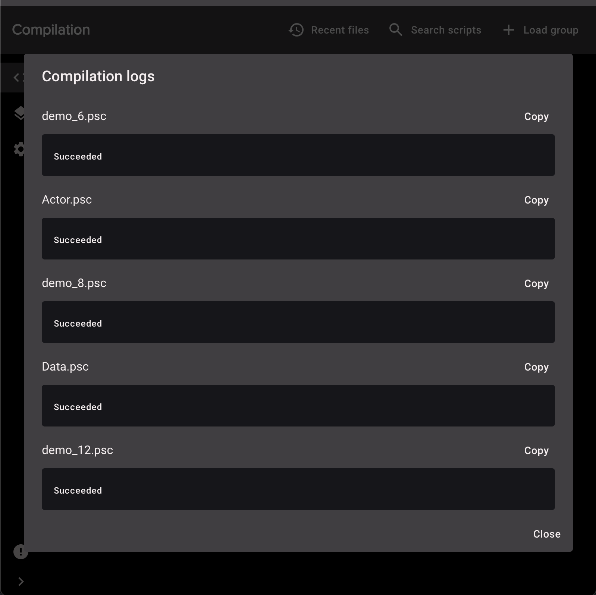
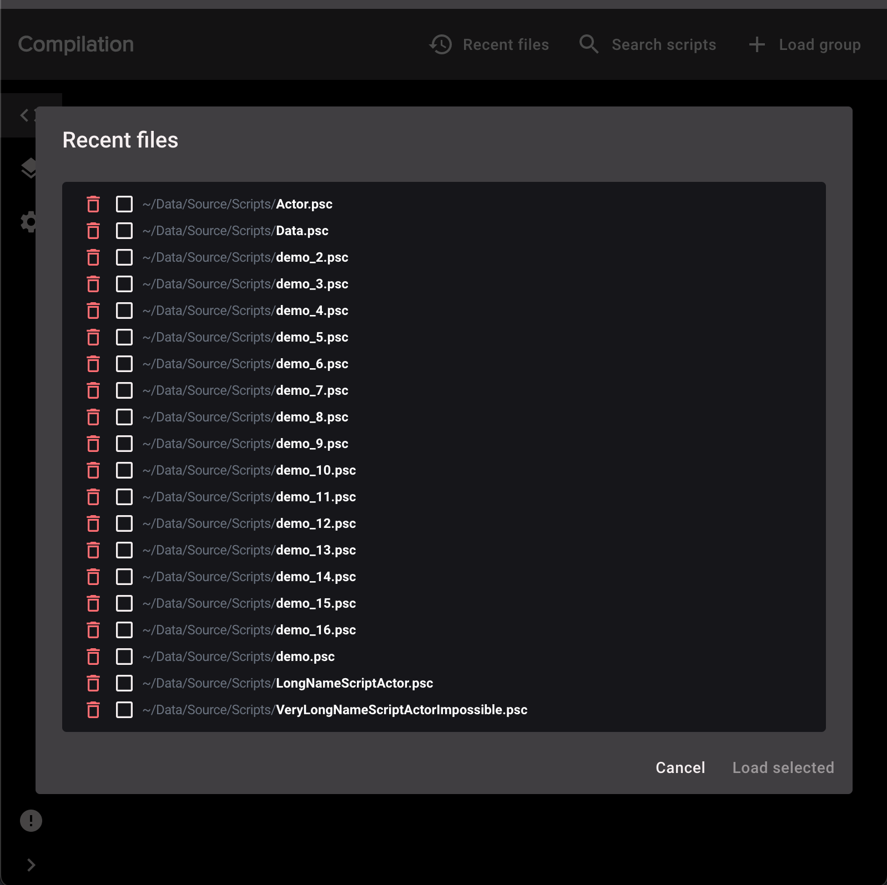
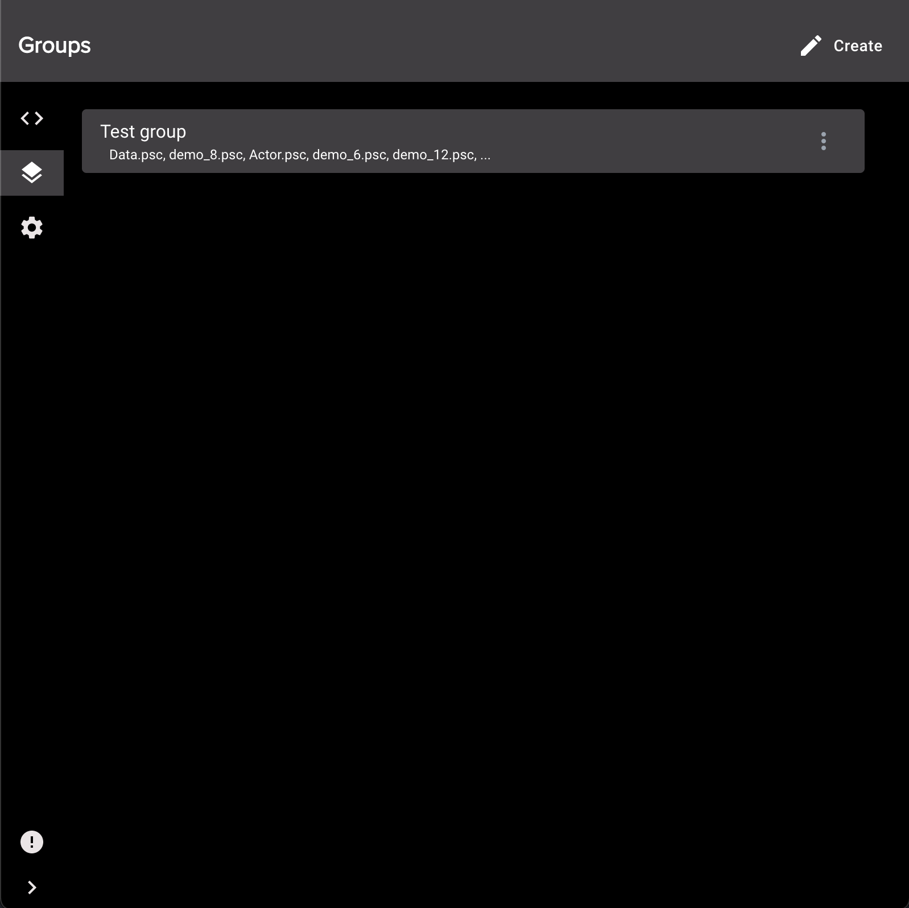
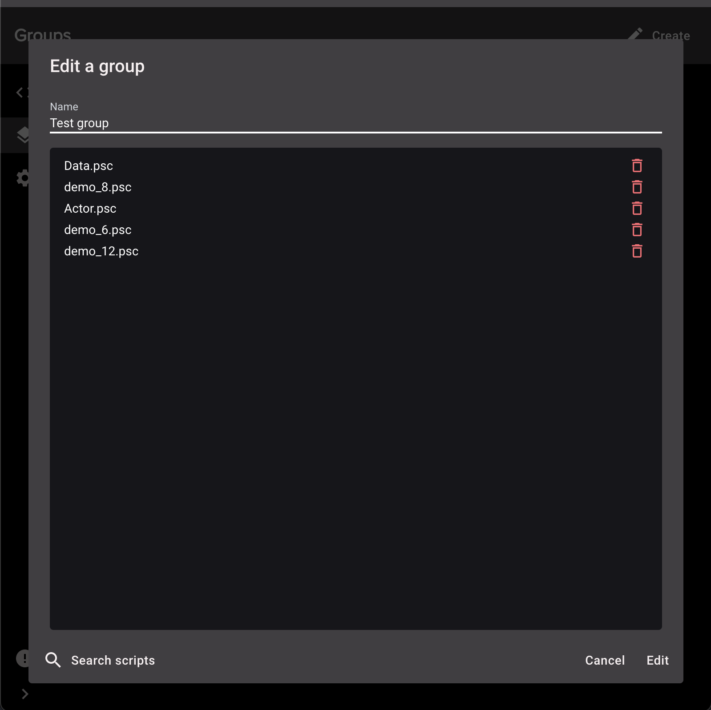
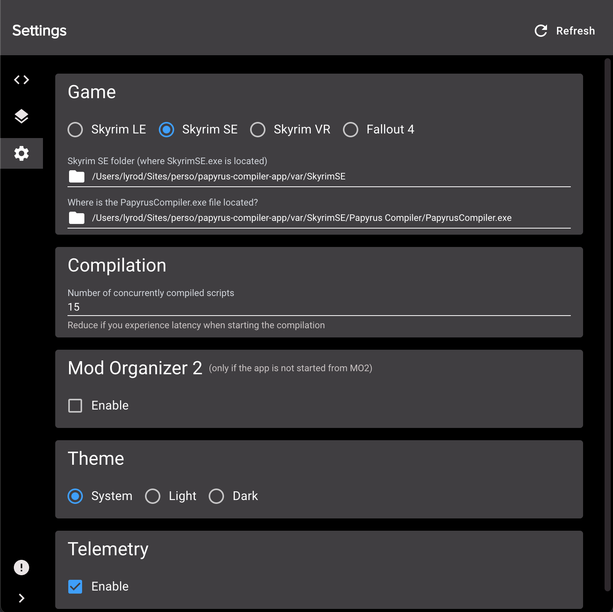
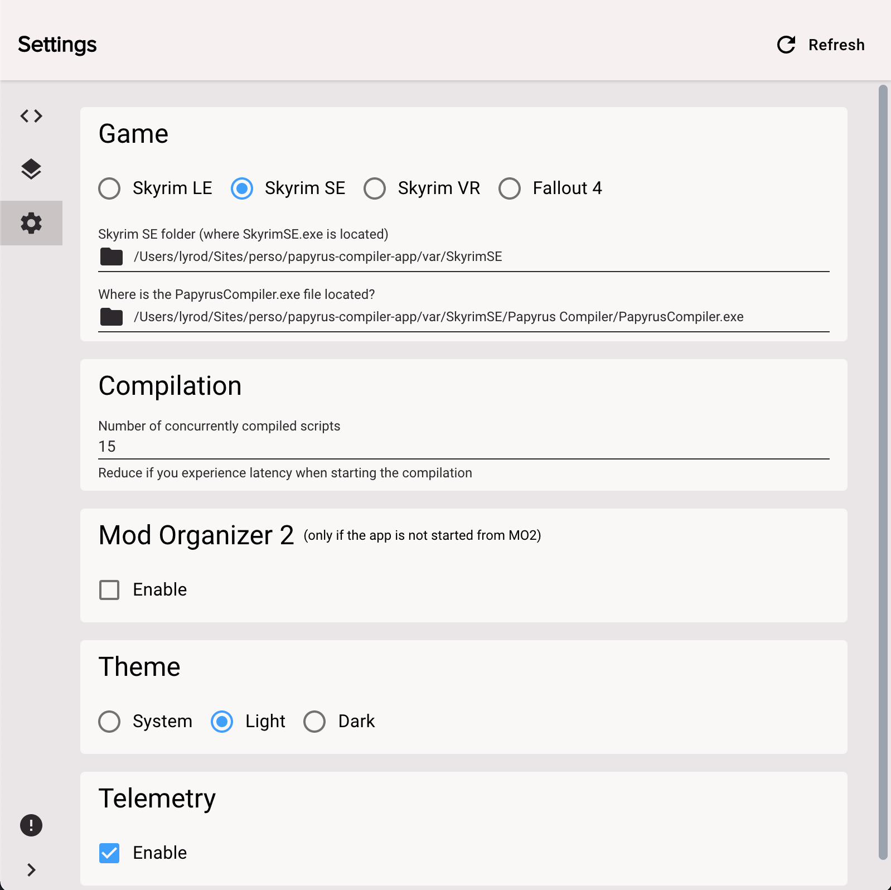

# Papyrus Compiler App

Project using Electron and React.

Use this application to compile .psc files to .pex with Creation Kit more easily.

Go to NexusMods to access the details.

LE version: [NexusMods LE](https://www.nexusmods.com/skyrim/mods/96339)

SE version: [NexusMods SE](https://www.nexusmods.com/skyrimspecialedition/mods/23852)

## Screenshots

Open

## TODO

- [ ] create a gitbook
- [ ] recent files checkbox show full path
