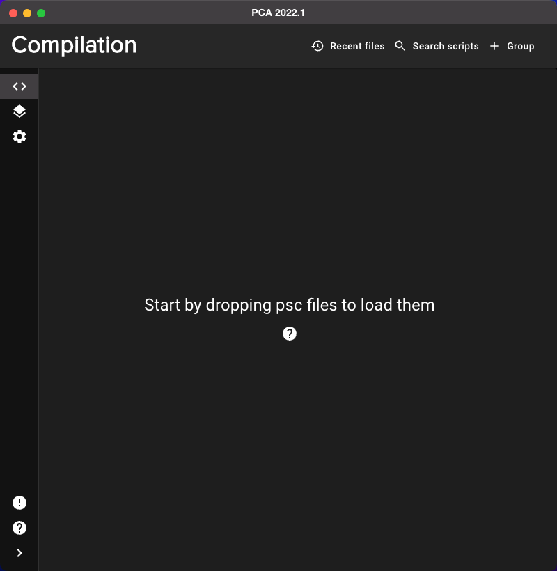

# Papyrus Compiler App

Project using Electron and React.

Use this application to compile .psc files to .pex with Creation Kit more easily.

Go to NexusMods to access the details.

LE version: [NexusMods LE](https://www.nexusmods.com/skyrim/mods/96339)

SE version: [NexusMods SE](https://www.nexusmods.com/skyrimspecialedition/mods/23852)

## Applications arguments

`--game-path`: set the game path (`C:\...\Skyrim Special Edition`)

`--game-type`: set the game type (`Skyrim SE`, `Skyrim LE`, `Skyrim VR`, `Fallout 4`)

`--compiler-path`: set the compiler path (`C:\...\Skyrim Special Edition\Papyrus Compiler\PapyrusCompiler.exe`)

`--output-path`: set the output path, where `.psc` will be compiled into `.pex` (`C:\...\Skyrim Special Edition\Data\Scripts`)

## Screenshots

Open

